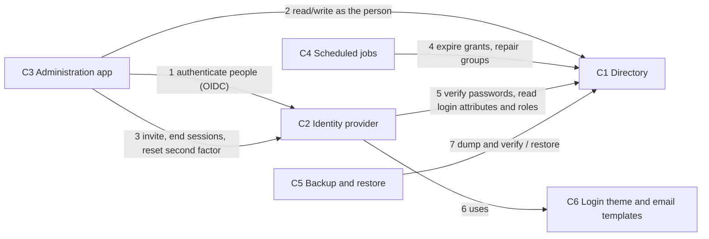
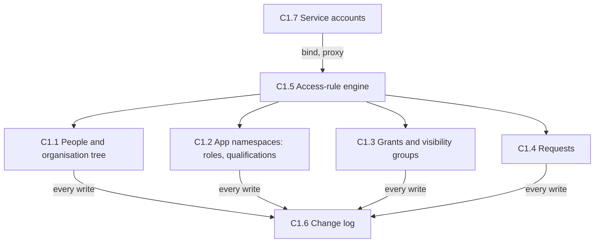
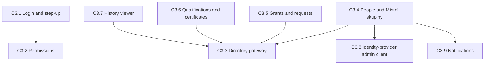
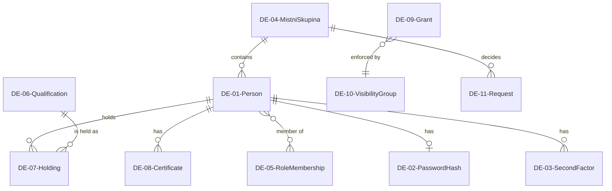
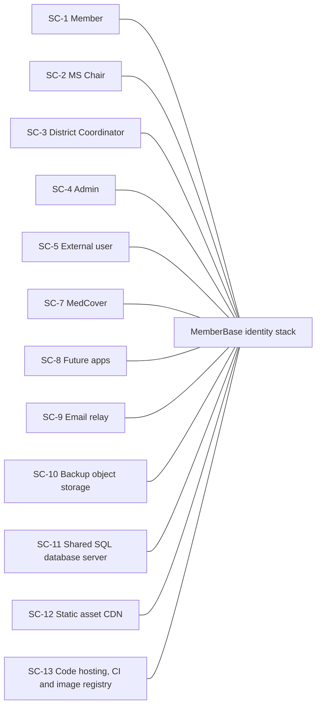
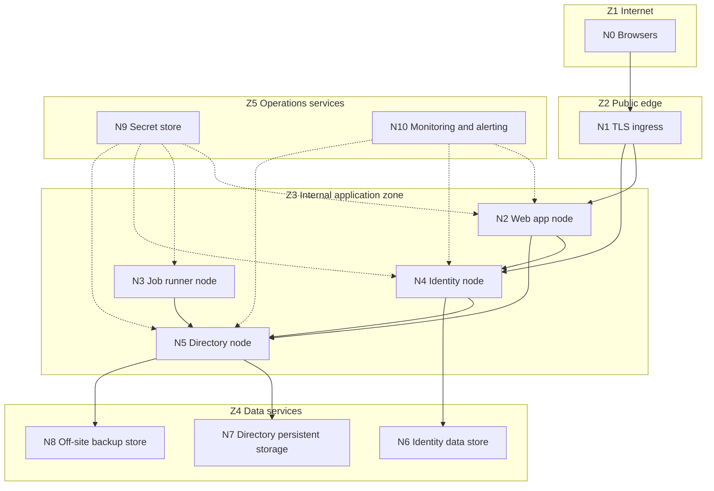
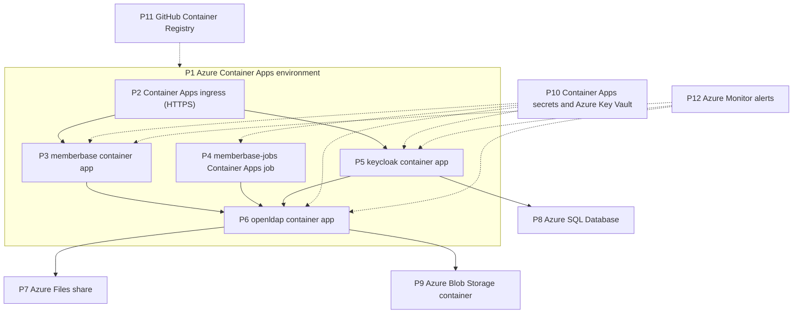

# Architecture Document – MemberBase identity stack

> Mode: **Review**. Scope: the shared member directory, the identity provider, the MemberBase
> administration app and the integration contract with MedCover. MedCover's internals are outside
> the scope and appear only as an external system.
>
> This is a public document. It describes the architecture with placeholder values
> (`example.org`, `dc=example,dc=org`) and contains no host names, resource names, secrets or
> other details of a real deployment.
>
> Status: **reviewed with the Stakeholder (step 16, iteration 3).** Requirements, principles and
> all ADs are confirmed. Statements derived from code or existing documentation and not yet
> confirmed by the Stakeholder are marked `(unconfirmed)`. Reviewed state: branch
> `fix/changelog-login`, 2026-10-02.

## 1. Purpose

The Stakeholder is the volunteer IT lead of one Oblastní spolek of the Czech Red Cross, who
develops and operates its apps. Today MedCover, the district's medical-cover scheduling app, owns
its users, passwords, roles and qualifications. Every future app would have to repeat that, and
personal data of members would end up copied in each one without any rule about who may see
whom.

The solution makes the people of the Oblastní spolek a shared, governed asset: one record and one
login per person, used by every app, with visibility of personal data limited to the person's own
Místní skupina unless its leadership agrees otherwise. Apps receive only the data they need and
never handle passwords or second factors. The related business processes are membership
administration (joining, inviting, moving between Místní skupiny, leaving), managing who may do
what in each app, keeping qualifications and certificates of members, and controlled sharing of
personal data between Místní skupiny.

## 2. Requirements

Sources: **Design** = the original design document (not public); **Code** = derived from the
current implementation; **Stakeholder** = stated or confirmed in this review. All MoSCoW ratings
are confirmed by the Stakeholder.

### 2.1 Use cases / scenarios

| ID | Name | Actor(s) | Goal | Main flow | Related FRs |
|----|------|----------|------|-----------|-------------|
| UC-01 | Log in once for all apps | Member, external user | Use MemberBase and MedCover with one account | 1. Opens an app. 2. Is redirected to the central login. 3. Enters password or uses a passkey; adds a second factor if required. 4. Returns to the app logged in; a second app does not ask again. | FR-16, FR-17, FR-18, FR-23 |
| UC-02 | Invite a new person | Admin, MS Chair, District Coordinator (external users) | Give a new person an account | 1. Creates the person in a Místní skupina (or as external user). 2. Sends the invitation. 3. Person sets a password from the email link. 4. First login activates the account. | FR-26, FR-27, FR-28, FR-37, FR-39 |
| UC-03 | Look up a colleague | Member | Find contact details of people one may see | 1. Opens the member list. 2. Searches or filters. 3. Sees only the people and attributes the directory allows. | FR-12, FR-13, FR-14, FR-25 |
| UC-04 | Share data between Místní skupiny | Admin; member and MS Chair (via request) | Let a person or a whole Místní skupina see another one | 1. Admin creates a grant (level, target, optional expiry), or a member files an access request that the target's Chair decides. 2. The grant takes effect at once. 3. An expired grant is revoked by the scheduled job. | FR-13, FR-15 |
| UC-05 | Move a member to another Místní skupina | Admin; MS Chair (via request) | Keep identity and history while changing branch | 1. Admin moves directly, or a Chair files a move request under the destination and its Chair approves. 2. The person's entry and child entries move; app roles are kept, branch roles removed. 3. Visibility follows the new branch. | FR-10, FR-15 |
| UC-06 | Change account status | Admin, MS Chair | Deactivate, archive or restore a person | 1. Changes the status. 2. Sessions are ended and, for archive, app roles removed. 3. Connected apps learn of it immediately. | FR-23, FR-28 |
| UC-07 | Manage roles and qualifications | Admin, MS Chair (holdings) | Control what a person may do and is qualified for in an app | 1. Assigns app roles (also in bulk). 2. Records qualification holdings and certificates. 3. Connected apps pick them up. | FR-29, FR-31, FR-32, FR-38 |
| UC-08 | Recover a lost second factor | Admin, member | Regain access after losing a phone | 1. Member contacts an Admin. 2. Admin verifies identity out of band and resets the second factor (recent login required). 3. Member is notified and sets up a new factor. | FR-19, FR-24 |
| UC-09 | Review history | Admin | See who changed what and when | 1. Opens the change log globally or per person. 2. Sees actor, time, old and new values; password hashes are masked. | FR-36 |
| UC-10 | Receive people in a connected app | MedCover (system) | Keep a local copy of the people with MedCover access | 1. Reads people with a MedCover role through its own directory account every 15 minutes and at each login. 2. Activates an invited person at their first login. 3. Archives people it no longer sees. | FR-06, FR-14, FR-38, FR-39, FR-40 |
| UC-11 | Request a certificate report | District Coordinator | Get up-to-date certificates of a Místní skupina | 1. Files a report request. 2. The Chair updates the certificates and approves. 3. The requester reads the report live. | FR-15, FR-32 |
| UC-12 | Restore the directory | Admin (A-04) | Recover from data loss or corruption | 1. Picks a verified nightly backup. 2. Starts the directory on empty storage with the restore setting. 3. Restores the identity provider's database to the same time. | NFR-04 |

### 2.2 Functional requirements

| ID | Requirement | MoSCoW | Source | Notes |
|----|-------------|--------|--------|-------|
| | **Directory and identity** | | | |
| FR-01 | Member identities (name, email, phone, account status, kind) are stored in one shared directory that is the system of record for all connected apps. | Must | Design | Built. |
| FR-02 | Passwords and second factors are held only by the identity layer; apps never receive or store them. | Must | Design | Built. |
| FR-03 | App roles are stored in the directory separately per app; what a role may do stays in each app's code. | Must | Design | Built. |
| FR-04 | MemberBase shows MedCover's role-to-permission mapping, fetched live from MedCover. | Could | Design | MedCover endpoint not built (unconfirmed). |
| FR-05 | New person attributes can be added without changing the connected apps. | Should | Design | |
| FR-06 | Each app and each person receives only the data needed for the operation at hand. | Must | Design | |
| FR-07 | Further apps can use the same people and login. | Should | Design | |
| | **Organisation** | | | |
| FR-08 | One deployment serves one Oblastní spolek; national and regional levels are not modelled. | Must | Design | |
| FR-09 | Every member belongs to exactly one Místní skupina; external users belong to none. | Must | Design | |
| FR-10 | A member can be moved to another Místní skupina without losing identity, roles or history. | Must | Design | Built, including bulk move. |
| FR-11 | Identifiers stay unique across deployments of other districts; exchange between deployments is not built. | Could | Design | |
| | **Visibility of personal data** | | | |
| FR-12 | By default a member sees the people of their own Místní skupina at the contact level (name, email, phone). | Must | Design | Level is configurable per deployment. |
| FR-13 | Grants unlock a named visibility level of a Místní skupina, the external users or one person, for a person or a whole Místní skupina, permanently or until an expiry date that is enforced automatically. | Must | Design, Code | Levels in code: name; name and certificates; contact; extended. |
| FR-14 | Everyone holding a MedCover role sees every other holder at the contact level with their MedCover qualifications and roles, wherever they belong. | Must | Design | |
| FR-15 | Requests: moves, access to named people and certificate reports are filed, decided by the Chairs of the deciding Místní skupina and carried out automatically. | Should | Code | Was post-MVP in the design; now built. |
| | **Authentication** | | | |
| FR-16 | One login works for MemberBase, MedCover and future apps (single sign-on). | Must | Design | |
| FR-17 | People log in with email and password, or with a passkey alone. | Must | Design | |
| FR-18 | Everyone can set up TOTP and passkeys; a second factor is mandatory for Admin roles of every app. | Must | Design | |
| FR-19 | An Admin can reset a person's second factor; the person is notified. | Must | Design, Code | |
| FR-20 | Self-service forgotten password and password change. | Must | Design | |
| FR-21 | Repeated failed logins lock the account temporarily, never permanently. | Must | Design | |
| FR-22 | Login pages and emails are in Czech and look like MedCover, including dark mode. | Should | Design | |
| FR-23 | Logout ends the app and the single sign-on session; deactivation and archiving cut access immediately. | Must | Design | |
| FR-24 | Sensitive actions (role changes, second-factor reset, email change) require a recent login. | Must | Design | |
| | **MemberBase administration** | | | |
| FR-25 | Member list with search and filters by Místní skupina, status and role, limited to what the viewer may see. | Must | Design | |
| FR-26 | Create a member or an external user; edit name, email and phone. Only Admins change email, and the old address is notified. | Must | Design | |
| FR-27 | Invite-only registration: invite (also in bulk), resend, cancel; no self-registration. | Must | Design, Code | |
| FR-28 | Lifecycle new → invited → active ↔ inactive → former (archived) and restore; people are archived, never deleted. | Must | Design | |
| FR-29 | Assign and remove app roles, also in bulk. | Must | Design | |
| FR-30 | Manage Místní skupiny and their Chairs. | Must | Design, Code | |
| FR-31 | Manage qualifications per app: definitions, hierarchy, holders; qualifications of different apps never mix. | Must | Design | |
| FR-32 | Record certificates per person with validity; only the person, their Chairs, District Coordinators, Admins and holders of a certificate grant read them. | Should | Code | Design had this post-MVP. |
| FR-33 | MS Chairs administer the people of their own Místní skupina, except people with a privileged role. | Should | Code | Design had this post-MVP. |
| FR-34 | District Coordinators read all people; they manage the external users. | Must | Design, Code | |
| FR-35 | Members edit their own phone number. | Must | Design | |
| FR-36 | Every change is recorded with actor, time, old and new values, and can be viewed by Admins. | Must | Design | |
| FR-37 | External users cannot use MemberBase; they hold only the MedCover role for external users and are invited to MedCover. | Must | Code | |
| FR-43 | Logged-in users can read what changed in each version. | Could | Code | ID assigned after FR-42; kept stable. |
| | **Connected apps (MedCover)** | | | |
| FR-38 | MedCover keeps a synced copy of the people with a MedCover role; changes arrive within 15 minutes, deactivation immediately. | Must | Design | MedCover side not merged (unconfirmed). |
| FR-39 | MedCover's first login activates an invited person. | Must | Code | |
| FR-40 | Historical records in connected apps stay linked to the right person, including archived people. | Must | Design | |
| | **Migration** | | | |
| FR-41 | All existing MedCover users move to the directory with status, roles, qualifications and a Místní skupina. | Must | Design | |
| FR-42 | The switch can be rolled back until MedCover's old credential data is removed. | Should | Design | |

### 2.3 Non-functional requirements

| ID | Category | Requirement | MoSCoW | Source | Notes |
|----|----------|-------------|--------|--------|-------|
| NFR-01 | Localisation | All UI, login pages and emails in Czech; code, repository and documentation in English. | Must | Design | |
| NFR-02 | Usability / devices | Works on mobile phones; simple for users with limited IT skills. | Must | Design | |
| NFR-03 | Availability | Reachable 24/7 over the Internet; no high availability required; one instance per district is acceptable. No numeric availability target. | Must | Design, Stakeholder | A numeric SLA is Won't have. |
| NFR-04 | Backup and DR | Daily backup of directory and identity-provider data, stored off the server, 30-day retention, 20 days immutable; RPO 1 day, RTO 12 hours. | Must | Design | |
| NFR-05 | Security – encryption | TLS on every hop, including app to directory and app to identity provider. | Must | Design | |
| NFR-06 | Security – credentials | Passwords hashed with a memory-hard algorithm; never logged, never readable by apps. | Must | Design | |
| NFR-07 | Security – least privilege | Each app and job uses its own account, limited to the data it needs. | Must | Design | |
| NFR-08 | Security – authorization | Visibility and change rights are enforced by the directory itself, so a bug in an app cannot reveal or change more. | Must | Design | |
| NFR-09 | Maintainability | Adding a visibility level or an attribute to a level is a configuration change, not an app release. | Should | Design | |
| NFR-10 | Data retention | Personal data is kept until archived; archived data is retained; no automatic erasure. | Must | Design | Legal basis: NFR-21. |
| NFR-11 | Cost | Only free, open-source components; runs on the existing hosting and reuses the existing database server. | Must | Design | |
| NFR-12 | Supportability | Operable by volunteers: documented setup, all configuration as code in the repository. | Must | Design | |
| NFR-13 | Performance / scale | Hundreds of members per district, at least 10 concurrent users; best-effort response times. | Must | Design, Stakeholder | A numeric response-time target is Won't have. |
| NFR-14 | Interoperability | Standard protocols only (OIDC, LDAP, WebAuthn), so components can be replaced and apps added. | Should | Design | |
| NFR-15 | Testability | 100 % line and branch coverage; every access rule has an allowed and a denied test; unit tests run without the identity provider. | Must | Design | |
| NFR-16 | Data integrity | Concurrent edits of the same entry never silently overwrite each other. | Must | Design | |
| NFR-17 | Security – audit | The change log cannot be altered by anyone, including Admins, and is kept 10 years. | Must | Code | 10 years is the configured purge age (unconfirmed). |
| NFR-18 | Security – public code | The repository is public: no secrets or details of a real deployment in code, history or documentation. | Must | Stakeholder | |
| NFR-19 | Supply chain | Dependencies pinned with hashes; base images and dependencies updated automatically. | Should | Design, Code | |
| NFR-20 | Observability | Every service is health-checked and an Admin is alerted when one fails; a failed or missing nightly backup raises an alert. | Must | Stakeholder | |
| NFR-21 | Privacy / compliance | Personal data is processed in line with the GDPR. Keeping archived people and the change log is based on the organisation's duty to keep a membership register. | Must | Stakeholder | |
| NFR-22 | Accessibility | Basic accessibility: semantic markup, keyboard use, sufficient contrast; no formal conformance level. | Should | Stakeholder | |
| NFR-23 | Geographic reach | Used within one country; no geographic distribution required. | Must | Design | |
| NFR-24 | Security – network | The directory is reachable only from inside the hosting environment; the identity provider's admin console is not reachable from the Internet. | Must | Design, Stakeholder | Implemented in the private infrastructure; verified at go-live. |

## 3. Baseline architecture

The baseline is the system as built in this repository, with the dev stack as the only running
environment. Production is designed but not yet deployed (unconfirmed).

**Overview.** One OpenLDAP directory per district holds people, passwords (Argon2), app roles,
qualifications, certificates, grants and requests. Keycloak 26 federates the directory and is the
only login (OIDC authorization code with PKCE, TOTP, passkeys, conditional second factor for the
`mfa-required` composite). MemberBase (Python 3.14, Flask, python-ldap, Bootstrap 5.3) has no
database: every person-facing read and write runs as the logged-in person through LDAP proxied
authorization, so the directory's access rules decide. The `accesslog` overlay is the audit trail.

**Components.**

| Component | What exists |
|-----------|-------------|
| Directory | Own image on Debian `slapd`, non-root, LDAPS and `ldapi` only, TLS 1.2 minimum, anonymous bind disabled, simple binds need TLS. Overlays `accesslog` (writes, old values, 10-year purge), `refint`, `unique`. Custom schema with `2.25.<uuid>` OIDs. About 60 access rules with a test matrix. Nightly LDIF backup with a restore check, and restore on start. |
| Identity provider | Keycloak realm `crc` as code: clients `memberbase` and `medcover` (confidential, PKCE S256, no direct grants, no implicit flow), LDAP federation writable for passwords only, read-only role mappers per app, only `active` and `invited` people can log in, temporary brute-force lockout after 5 failures, password policy (length 10, not username or email), Czech login theme, login events kept 90 days, admin events on. Account console enabled and linked from „Můj profil“. |
| MemberBase web | Blueprints `main`, `members`, `admin`, `requests`; permission map in code; the person and their roles re-read on every request; step-up after 5 minutes; CSRF protection, CSP, frame denial; Bootstrap from a public CDN with subresource integrity; `/health`. |
| MemberBase jobs | `expire-grants` and `repair-members` every 15 minutes. |
| Service accounts | Directory: `keycloak`, `medcover-sync`, `memberbase` in `ou=services`; `memberbase` may proxy only for people. Identity provider: the `memberbase` client's service account holds `view-users` and `manage-users` for the realm. |
| Build and release | CI: black, isort, flake8, mypy, full tests with a throwaway directory, realm JSON check. Release on tag: three images to a public container registry, tagged with the version and `latest`. |

**Context and integrations.** MedCover logs in through the same realm and reads people through
`medcover-sync`; MemberBase uses the Keycloak admin API (invitations, ending sessions, removing
second factors) with its own client's service account; email via SMTP (a mail catcher in dev).

**Deployment.** Dev: services in a Compose project shared with MedCover's dev stack. Production
design: one container per service in a managed container platform, directory data on a network
file share with exactly one replica, Keycloak database on the existing managed SQL server,
backups in object storage, images published by the release workflow.

**Known problems** are listed in the gap analysis (section 16).

## 4. Architecture principles

| ID | Name | Statement | Rationale | Implications |
|----|------|-----------|-----------|--------------|
| P-01 | Authorization lives in the data store | The directory decides who may read or change which data; apps mirror these rules for usability only. | A bug in any app must not reveal or change more data (NFR-08). | Every permission change needs a directory rule change with an allowed and a denied test; apps must handle refusals gracefully. |
| P-02 | Act as the person | Every read or change a person makes runs with that person's identity. Service accounts act on their own only for listed, reviewed cases. | Keeps P-01 meaningful and the audit trail truthful (FR-36). | A list of agreed exceptions (login lookup, activation, jobs, carrying out approved requests, request notifications, privilege check) is maintained and reviewed. |
| P-03 | Need-to-know | Each app and each person receives only the data needed for the task. | Data protection (FR-06, NFR-21). | Minimal tokens; one directory account per app with a narrow rule set; new consumers get their own account. |
| P-04 | One identity, credentials in one place | Each person has one identity for all apps; passwords and second factors exist only in the identity layer. | Single sign-on, fewer attack surfaces (FR-02, FR-16). | Apps use a standard login protocol and never see credentials; password and second-factor screens belong to the identity provider. |
| P-05 | Open standards and free open source | Use standard protocols and free open-source components. | Replaceability, cost (NFR-11, NFR-14). | Paid or proprietary components need an explicit exception. |
| P-06 | Everything as code, everything tested | Schema, access rules, identity-provider configuration and theme are versioned; code has full coverage and every access rule an allowed and a denied test. | Volunteers must reproduce and change the system safely (NFR-12, NFR-15). | Changes made live must be written back to the repository; changes to a running directory or realm ship as explicit steps. |
| P-07 | *Withdrawn by the Stakeholder.* | | | |
| P-08 | Archive, never delete; tamper-proof audit | People are archived, not deleted; the change log cannot be altered by anyone. | History in all apps stays intact; legal basis for retention (NFR-10, NFR-17, NFR-21). | No delete actions; the audit store is append-only for everyone. |
| P-09 | Trusted admins | Admins are trusted; there is no four-eyes approval. Their power is controlled by a mandatory second factor and the audit trail. | Small volunteer organisation; approval workflows would block work. | Admin accounts are high-value targets: mandatory second factor, recent login for sensitive actions, audit. |
| P-10 | Public by design | Code and documentation are public; deployment specifics live only in private configuration. | Transparency and reuse by other districts (NFR-18). | Placeholders in examples; secrets and real names only in untracked or private configuration; every change is checked before publishing. |

## 5. Architecture overview

**Architecture type: a central directory as system of record and policy enforcement point, a
central identity provider, and thin, stateless apps.** The directory holds all person data and
enforces who may see and change what. The identity provider is the only place where people
prove who they are. Apps (the administration app and the connected apps) authenticate people
through the identity provider and access person data only through the directory, either as the
logged-in person (administration app) or through a narrowly scoped app account (connected apps,
which keep their own synced copy).

Why: the main goal is shared identities with need-to-know access across several apps (FR-06,
FR-07, NFR-08). Placing enforcement in the shared data store, instead of in each app, means one
rule set protects the data from every reader (P-01). A monolith inside the first app would give
that app write access to all identities and couple every future app to it; microservices would
add moving parts that volunteers cannot run (NFR-12).

Key design considerations:

- **Security by design:** person-scoped operations (P-02), separate accounts per app (NFR-07),
  mandatory second factor for admins (FR-18), recent login for sensitive actions (FR-24), TLS on
  every hop (NFR-05).
- **Privacy:** visibility by Místní skupina with explicit grants (FR-12–FR-14); minimal tokens and
  sync scope (P-03); archive with a legal basis instead of deletion (P-08, NFR-21).
- **Audit and integrity:** an append-only change log written by the directory itself (FR-36,
  NFR-17); optimistic locking for concurrent edits (NFR-16).
- **Operability:** a small number of services, all configuration as code (P-06), verified
  backups independent of the primary storage (NFR-04).
- **Openness:** standard protocols and free open-source components (P-05); public code without
  deployment details (P-10).

## 6. Component model

### 6.1 Level 1 – Solution

| No. | Component | Responsibility | Related requirements |
|-----|-----------|----------------|----------------------|
| C1 | Directory | System of record for people, Místní skupiny, app roles, qualifications, certificates, grants and requests; enforces access rules; records every change. | FR-01, FR-03, FR-05, FR-06, FR-08–FR-15, FR-28, FR-31–FR-34, FR-36, NFR-06, NFR-08, NFR-09, NFR-16, NFR-17 |
| C2 | Identity provider | Login (password, passkey), second factors, sessions, single sign-on, lockout, password reset, invitation emails, tokens per app. | FR-02, FR-16–FR-24, FR-27, NFR-06, NFR-14 |
| C3 | Administration app | Czech web UI for members, Chairs, Coordinators and Admins over the directory; checks permissions for usability; starts identity-provider actions. | FR-04, FR-10, FR-13, FR-15, FR-19, FR-24–FR-37, FR-43, NFR-01, NFR-02, NFR-22 |
| C4 | Scheduled jobs | Revoke expired grants; repair members groups, archived people's roles and missing per-unit entries. | FR-13, FR-28, FR-33 |
| C5 | Backup and restore | Nightly dump of configuration, data and change log, proof that the dump loads, off-site upload; restore into empty storage on start. | NFR-04 |
| C6 | Login theme and email templates | Czech pages and emails of the identity provider in the look of MedCover. | FR-22, NFR-01, NFR-02 |

| No. | Interaction | Description | Related requirements |
|-----|-------------|-------------|----------------------|
| 1 | C3 → C2 authenticate | The app sends people to the identity provider and receives a token with the member identifier and the app's roles. | FR-16, FR-23 |
| 2 | C3 → C1 as the person | Every person-facing read and write runs with the logged-in person's identity; the directory decides. | NFR-08, FR-25–FR-36 |
| 3 | C3 → C2 admin actions | Invitations, ending sessions and removing second factors, through a dedicated admin client (AD-27). | FR-19, FR-23, FR-27 |
| 4 | C4 → C1 maintenance | Revoke expired grants; repair members groups, archived people's roles and per-unit entries. | FR-13, FR-28 |
| 5 | C2 → C1 federation | Verify passwords, write new password hashes, read login attributes and role memberships. | FR-02, FR-17, FR-20 |
| 6 | C2 → C6 presentation | Login, account and email pages rendered with the Czech theme. | FR-22 |
| 7 | C5 ↔ C1 backup | Nightly dump and load check; restore into empty storage on start. | NFR-04 |

### 6.2 Level 2 – Directory (C1)

| No. | Component | Responsibility | Related requirements |
|-----|-----------|----------------|----------------------|
| C1.1 | People and organisation tree | Místní skupiny with their people, external users, Chair groups, members groups; person child entries (qualification holdings, certificates). | FR-01, FR-08–FR-10, FR-28, FR-30, FR-32, FR-37 |
| C1.2 | App namespaces | Per-app role groups and qualification definitions, so apps never mix. | FR-03, FR-29, FR-31 |
| C1.3 | Grants and visibility groups | Grant records with expiry; readers groups per level per Místní skupina, external users and person. | FR-12–FR-14, NFR-09 |
| C1.4 | Requests | Move, access and certificate-report requests under the deciding Místní skupina, with forward-only status. | FR-15 |
| C1.5 | Access-rule engine | Decides every read and write for people and service accounts; deny by default. | FR-06, NFR-07, NFR-08 |
| C1.6 | Change log | Append-only record of every write with actor, old and new values. | FR-36, NFR-17 |
| C1.7 | Service accounts | One account per consumer (identity provider, MedCover sync, administration app), each with its own rules. | NFR-07 |

### 6.3 Level 2 – Administration app (C3)

| No. | Component | Responsibility | Related requirements |
|-----|-----------|----------------|----------------------|
| C3.1 | Login and step-up | OIDC login, logout, re-reading the person on every request, recent-login check. | FR-16, FR-23, FR-24, FR-37 |
| C3.2 | Permissions | Role-to-permission mapping of the app, Chair scope; shows only actions the directory would allow. | FR-03, FR-33, FR-34 |
| C3.3 | Directory gateway | The only code that talks to the directory: proxied identity, escaping, optimistic locking, error mapping. | NFR-08, NFR-16 |
| C3.4 | People and Místní skupiny | List, create, edit, invite, status, move, roles, units, Chairs. | FR-10, FR-25–FR-30, FR-35 |
| C3.5 | Grants and requests | Grant management; filing, deciding and carrying out requests. | FR-13, FR-15 |
| C3.6 | Qualifications and certificates | Definitions, hierarchy, holdings, certificates, reports. | FR-31, FR-32 |
| C3.7 | History viewer | Change log per person and global, with masked password hashes. | FR-36 |
| C3.8 | Identity-provider admin client | Invitations, ending sessions, removing second factors, with credentials separate from the login client (AD-27). | FR-19, FR-23, FR-27 |
| C3.9 | Notifications | Emails about email changes and second-factor resets; request notifications. | FR-15, FR-19, FR-26 |

## 7. Data / information model

| ID | Entity | Description | Owning component | Classification | Retention |
|----|--------|-------------|------------------|----------------|-----------|
| DE-01 | Person | Name, email, phone, status, kind, stable member identifier, status date. | C1.1 | Personal | Kept; archived, never deleted (NFR-10). |
| DE-02 | Password hash | Memory-hard hash of the person's password. | C1.1 (written via C2) | Sensitive personal (credential) | Replaced on change; old hashes remain in the change log (DE-12) and backups. |
| DE-03 | Second factors | TOTP secrets and passkey public keys. | C2 | Sensitive personal (credential) | Until removed by the person or an Admin. |
| DE-04 | Místní skupina | Unit with identifier and name; Chair group, members group. | C1.1 | Internal | Kept. |
| DE-05 | App role membership | Which person holds which role in which app. | C1.2 | Personal | Removed on archive; history in DE-12. |
| DE-06 | Qualification definition | Name, description, hierarchy, app-specific flags, per app. | C1.2 | Internal | Kept. |
| DE-07 | Qualification holding | Person holds a qualification, optional validity. | C1.1 | Personal | Kept with the person. |
| DE-08 | Certificate | Certificate of a person with validity. | C1.1 | Personal (restricted visibility) | Kept with the person. |
| DE-09 | Grant | Who may see what at which level, expiry, approver. | C1.3 | Personal (references people) | Membership revoked at expiry; record kept. |
| DE-10 | Visibility groups | Readers groups per level; members groups. | C1.3 | Internal | Maintained by C3, C4. |
| DE-11 | Request | Type, requester, target, named people, status, decision. | C1.4 | Personal | Kept. |
| DE-12 | Change log entry | Actor, time, operation, old and new values. | C1.6 | Sensitive personal (contains all of the above, including password hashes) | 10 years, then purged (NFR-17). |
| DE-13 | Sessions and login events | Single sign-on sessions, login and admin events, lockout counters. | C2 | Personal | Sessions up to 24 h; events 90 days. |
| DE-14 | Backup set | Nightly dump of configuration, data and change log, with checksums. | C5 | Sensitive personal | 20 days immutable, deleted after 30 days. |
| DE-15 | Role-permission mapping | What each app role may do. | C3.2 (and each app) | Internal | Versioned with the code. |

Main data flows (numbering of section 6.1):

- Flow 1/5: a login reads DE-01, DE-02 and DE-05 from C1 into C2; C2 issues a token with the
  member identifier and the app's roles only.
- Flow 2: C3 reads and writes DE-01 and DE-04 to DE-11 as the logged-in person; every write
  creates DE-12.
- Flow 3: C3 asks C2 to send invitations, end sessions and remove DE-03.
- Flow 4: C4 removes expired grant memberships (DE-09, DE-10) and repairs DE-05 and DE-10.
- Flow 7: C5 copies everything in C1, including DE-02 and DE-12, to DE-14 off-site.
- To MedCover (section 9): DE-01 (contact level), DE-05 (MedCover roles), DE-06/DE-07 (MedCover
  namespace) and visibility-group memberships, for people with a MedCover role only.

## 8. Architectural decisions

AD numbering in this document is independent of the original design document. All ADs below are
**Decided**.

### AD-01 Hosting model
| Property | Value |
|----------|-------|
| AD number | AD-01 |
| Subject area | Hosting / deployment |
| AD name | One container stack per district on the existing managed container platform |
| Status | Decided |
| Issue or problem statement | Where and how do the directory, identity provider and administration app run? |
| Assumptions | – |
| Motivation | Determines cost, operations effort and storage options. |
| Options | **Option 1: Azure Container Apps, the managed container platform MedCover already uses.** Pros: no servers to patch, same tooling and secrets as MedCover, ingress with TLS. Cons: only network file shares for persistent storage (R-01).   **Option 2: Virtual machine with Compose.** Pros: local disk for the directory. Cons: OS patching and hardening by volunteers.   **Option 3: On-premises server.** Pros: full control. Cons: no hardware, no on-call, off-site backups extra. |
| Decision | Option 1: one stack per Oblastní spolek in MedCover's Azure Container Apps environment. Secrets as Container Apps secrets, the SMTP password from Azure Key Vault. Infrastructure defined as code (Bicep) in the private infrastructure repository. |
| Justification | NFR-11 (existing hosting), NFR-12 (no servers to operate), FR-08; P-05 is not affected. |
| Implications | The directory needs special handling on network storage (AD-17); production configuration lives in the private infrastructure repository (P-10). |
| Derived requirements | Stop-then-start updates for the directory; restore drill before go-live. |
| Related decisions | AD-17, AD-18, AD-24 |

### AD-02 Identity store
| Property | Value |
|----------|-------|
| AD number | AD-02 |
| Subject area | Data storage |
| AD name | OpenLDAP as system of record |
| Status | Decided |
| Issue or problem statement | Where do identities, password hashes, roles, qualifications and grants live? |
| Assumptions | – |
| Motivation | The store must enforce per-branch, per-attribute visibility for every reader. |
| Options | **Option 1: OpenLDAP.** Pros: per-subtree and per-attribute access rules for people and service accounts; Argon2; small; standard protocol. Cons: rules written by hand; rare skills.   **Option 2: 389 Directory Server.** Pros: web console. Cons: heavier, uncommon in containers.   **Option 3: Identity provider's own database.** Pros: one service less. Cons: no per-attribute read rules; visibility only in app code.   **Option 4: Cloud identity service.** Pros: managed. Cons: tenant accounts for members, coarse permissions, no branch model. |
| Decision | Option 1, one directory per district with a custom schema. |
| Justification | Only option meeting NFR-08 and P-01; NFR-11, NFR-14, P-05. |
| Implications | Access-rule test matrix (NFR-15); LDIF-based configuration (P-06). |
| Derived requirements | Every rule needs an allowed and a denied test. |
| Related decisions | AD-11, AD-12, AD-15, AD-22 |

### AD-03 Identity provider
| Property | Value |
|----------|-------|
| AD number | AD-03 |
| Subject area | Identity and access management |
| AD name | Keycloak with LDAP federation and OIDC |
| Status | Decided |
| Issue or problem statement | How do people log in to all apps against the directory, with second factors? |
| Assumptions | – |
| Motivation | Credentials must not reach the apps (P-04); single sign-on (FR-16). |
| Options | **Option 1: Apps bind to the directory.** Pros: no extra service. Cons: apps see passwords; no SSO, passkeys or shared MFA.   **Option 2: Keycloak.** Pros: SSO, TOTP, passkeys, conditional MFA, lockout, reset, back-channel logout, realm as code. Cons: about 1 GB RAM, large admin surface, needs a database.   **Option 3: authentik.** Pros: modern flows. Cons: smaller community, separate database type.   **Option 4: Authelia / Dex.** Pros: light. Cons: missing admin, claim shaping or own login features. |
| Decision | Option 2. Federation writable only for passwords; authorization code with PKCE; database on the existing Azure SQL server. |
| Justification | FR-16–FR-23, NFR-14, P-04, P-05, NFR-11. |
| Implications | The identity provider holds DE-03 and DE-13 and must be backed up with the directory; its admin console must not be public. |
| Derived requirements | Realm kept identical to the live configuration (P-06). |
| Related decisions | AD-19, AD-26, AD-27 |

### AD-04 Where permissions live
| Property | Value |
|----------|-------|
| AD number | AD-04 |
| Subject area | Authorization |
| AD name | Roles in the directory, role-to-permission mapping in each app |
| Status | Decided |
| Issue or problem statement | Should the meaning of a role be stored with the role? |
| Assumptions | – |
| Motivation | Avoid drift between code and data. |
| Options | **Option 1: Mapping in the directory.** Pros: new roles without a release. Cons: permission codes are defined by code anyway; drift.   **Option 2: Roles in directory, mapping in code.** Pros: mapping tested with the code. Cons: new roles need a release.   **Option 3: Hybrid with per-person exceptions.** Pros: flexible. Cons: two places to debug. |
| Decision | Option 2. |
| Justification | FR-03, NFR-15, P-06. |
| Implications | Permission changes need a matching directory rule (P-01). MedCover's mapping is shown live only when MedCover exposes it (FR-04). |
| Derived requirements | – |
| Related decisions | AD-02 |

### AD-05 How connected apps get person data
| Property | Value |
|----------|-------|
| AD number | AD-05 |
| Subject area | Integration |
| AD name | Local copy synced through a scoped directory account |
| Status | Decided |
| Issue or problem statement | MedCover needs data of people who are not logged in and must keep history. |
| Assumptions | – |
| Motivation | FR-38, FR-40 without giving MedCover more than it needs (FR-06). |
| Options | **Option 1: Token only.** Pros: least data. Cons: cannot email or pick people who never logged in.   **Option 2: Live lookups per request.** Pros: no copy. Cons: directory outage breaks every page; foreign keys need local rows anyway.   **Option 3: Local copy by sync job, read at login, back-channel logout.** Pros: foreign keys unchanged; survives short outages; directory rules cap the copy. Cons: personal data copied; up to 15 minutes lag.   **Option 4: Push from the administration app.** Pros: instant. Cons: must know every consumer and retry. |
| Decision | Option 3. MedCover's single write is activating an invited person at first login. |
| Justification | FR-06, FR-38–FR-40, P-03. |
| Implications | MedCover never archives on an empty or failed search; the sync account sees exactly the people with MedCover access. |
| Derived requirements | The contract table in `DEVOPS.md` is the interface definition. |
| Related decisions | AD-06, AD-21 |

### AD-06 Stable identifiers
| Property | Value |
|----------|-------|
| AD number | AD-06 |
| Subject area | Data model |
| AD name | Custom UUID attributes, carried in a dedicated claim |
| Status | Decided |
| Issue or problem statement | Which values link people and objects across directory, identity provider, apps and deployments? |
| Assumptions | – |
| Motivation | Moves change the DN; MedCover foreign keys must stay valid (FR-10, FR-40). |
| Options | **Option 1: Email.** Pros: readable. Cons: changes, reused.   **Option 2: DN.** Pros: native. Cons: changes on move.   **Option 3: Directory-generated UUID.** Pros: automatic. Cons: new value after re-import.   **Option 4: Own UUID attributes.** Pros: survive moves, re-import and cross-district exchange; existing MedCover UUIDs reused. Cons: uniqueness must be enforced. |
| Decision | Option 4, with uniqueness enforced by the directory. The token claim is `crc_member_id`, not `sub` (agreed deviation from the design). |
| Justification | FR-10, FR-11, FR-40. |
| Implications | Uniqueness overlay on all identifier attributes and email. |
| Derived requirements | – |
| Related decisions | AD-11 |

### AD-07 How the administration app writes
| Property | Value |
|----------|-------|
| AD number | AD-07 |
| Subject area | Security controls / audit |
| AD name | Proxied authorization with directory-written change log |
| Status | Decided |
| Issue or problem statement | How does the app change data on behalf of a person with trustworthy enforcement and audit? |
| Assumptions | – |
| Motivation | NFR-08, FR-36. |
| Options | **Option 1: Identity-provider admin API only.** Pros: one API. Cons: no per-branch rules; broad admin roles.   **Option 2: Full-write service account, rights in code, own audit table.** Pros: simple rules. Cons: one enforcement layer; audit can be forgotten; needs a database.   **Option 3: Proxied authorization as the person; change log written by the directory.** Pros: directory checks the real person; audit cannot be skipped; no app database. Cons: rules for human roles are more work. |
| Decision | Option 3. Agreed exceptions where the service account acts itself: login lookup, activation, jobs, carrying out approved requests, request notifications and names, privilege check. |
| Justification | P-01, P-02, P-08, NFR-08, FR-36. |
| Implications | Whoever holds the app's directory credential can act as any person; the credential stays in the app container, proxying is limited to people, the directory is internal only. |
| Derived requirements | Escaping of every filter and DN value in one gateway module (C3.3). |
| Related decisions | AD-20, AD-25 |

### AD-08 Form of the administration app
| Property | Value |
|----------|-------|
| AD number | AD-08 |
| Subject area | Architecture style / framework |
| AD name | New stateless Flask app |
| Status | Decided |
| Issue or problem statement | Build a new app, extend MedCover, or use an existing directory admin tool? |
| Assumptions | – |
| Motivation | FR-25–FR-37 for non-IT users in Czech. |
| Options | **Option 1: Module in MedCover.** Pros: no new deployment. Cons: MedCover would need write access to all identities (against FR-06).   **Option 2: Generic LDAP admin tool.** Pros: ready. Cons: technical, not Czech, no invitations or grants.   **Option 3: Identity-provider admin console.** Pros: ready. Cons: too technical; no branch model.   **Option 4: New Flask app on MedCover's stack.** Pros: same skills and tooling; Czech UX. Cons: one more codebase. |
| Decision | Option 4: Flask with Jinja2 and Bootstrap, served by gunicorn, without its own database. |
| Justification | FR-06, NFR-01, NFR-02, NFR-12, P-01. |
| Implications | All state is in the directory and the identity provider. |
| Derived requirements | – |
| Related decisions | AD-07, AD-16 |

### AD-09 Password migration
| Property | Value |
|----------|-------|
| AD number | AD-09 |
| Subject area | Migration |
| AD name | Forced password reset at cutover |
| Status | Decided |
| Issue or problem statement | MedCover's password hashes cannot be verified by the new stack. |
| Assumptions | – |
| Motivation | FR-41. |
| Options | **Option 1: Forced reset.** Pros: no extra code; clean hashes. Cons: everyone acts once.   **Option 2: Lazy migration.** Pros: invisible for active users. Cons: extra code, two password stores.   **Option 3: Convert hashes.** Pros: invisible. Cons: impossible for the hash format used. |
| Decision | Option 1, announced in advance. |
| Justification | P-04, NFR-06. |
| Implications | Support load in the first days. |
| Derived requirements | – |
| Related decisions | AD-10 |

### AD-10 Rollout strategy
| Property | Value |
|----------|-------|
| AD number | AD-10 |
| Subject area | Migration |
| AD name | Switchable login mode in MedCover |
| Status | Decided |
| Issue or problem statement | Switch in one step or keep a way back? |
| Assumptions | – |
| Motivation | FR-42. |
| Options | **Option 1: Big bang.** Pros: no temporary code. Cons: no quick rollback.   **Option 2: A setting for old and new login, cleaned up after a stable month.** Pros: one-setting rollback. Cons: temporary dual code. |
| Decision | Option 2. |
| Justification | FR-42. |
| Implications | Passwords set during the window are lost on rollback. |
| Derived requirements | – |
| Related decisions | AD-09 |

### AD-11 Directory tree layout
| Property | Value |
|----------|-------|
| AD number | AD-11 |
| Subject area | Data model |
| AD name | People inside their Místní skupina; external users separate |
| Status | Decided |
| Issue or problem statement | How are units, people and external users arranged, given visibility follows the unit? |
| Assumptions | – |
| Motivation | FR-08–FR-13. |
| Options | **Option 1: Flat people list with unit attribute.** Pros: moves are attribute changes. Cons: complex value-based rules.   **Option 2: People inside their unit subtree.** Pros: simple subtree rules, children inherit. Cons: a move is a rename.   **Option 3: Full national tree.** Pros: mirrors the organisation. Cons: levels that are not deployed. |
| Decision | Option 2; external users under their own branch; the district is the root. |
| Justification | FR-09, FR-12, NFR-08. |
| Implications | Renames are harmless because identity is never the DN (AD-06); referential integrity updates groups. |
| Derived requirements | – |
| Related decisions | AD-06, AD-12 |

### AD-12 Visibility model
| Property | Value |
|----------|-------|
| AD number | AD-12 |
| Subject area | Authorization |
| AD name | Named levels, readers group per level, static members groups |
| Status | Decided |
| Issue or problem statement | How are default visibility, grants and attribute sets expressed and enforced? |
| Assumptions | – |
| Motivation | FR-12–FR-14, NFR-08, NFR-09. |
| Options | **Option 1: Attribute list per grant.** Pros: flexible. Cons: access rules are static configuration.   **Option 2: Named levels with readers groups per unit, external users and person.** Pros: directory-enforced; grants are group memberships. Cons: coarser than per-attribute grants.   **Option 3: Enforcement in app code.** Pros: simple. Cons: every app re-implements it. |
| Decision | Option 2. Members groups are static and maintained by the app and the repair job, because nested or dynamic groups do not affect access rules (agreed deviation). MedCover access is a fixed rule that follows the MedCover roles. |
| Justification | P-01, P-03, NFR-08, NFR-09. |
| Implications | Repair job needed (C4); new levels need rule and test changes. |
| Derived requirements | – |
| Related decisions | AD-11, AD-22 |

### AD-13 Qualifications and certificates
| Property | Value |
|----------|-------|
| AD number | AD-13 |
| Subject area | Data model |
| AD name | Definitions under the owning app; holdings and certificates as person child entries |
| Status | Decided |
| Issue or problem statement | How are per-app qualifications and dated personal records stored? |
| Assumptions | – |
| Motivation | FR-31, FR-32. |
| Options | **Option 1: Qualification as group.** Pros: simple. Cons: no per-person data.   **Option 2: Namespaced definitions, child-entry holdings and certificates.** Pros: per-app separation, dates, inherited visibility. Cons: more entries.   **Option 3: Separate SQL database.** Pros: rich queries. Cons: outside directory rules. |
| Decision | Option 2. |
| Justification | FR-31, FR-32, P-01. |
| Implications | Certificates get their own stricter rule and grant level. |
| Derived requirements | – |
| Related decisions | AD-11 |

### AD-14 Removing people
| Property | Value |
|----------|-------|
| AD number | AD-14 |
| Subject area | Data lifecycle |
| AD name | Archive only |
| Status | Decided |
| Issue or problem statement | What happens when a person leaves? |
| Assumptions | – |
| Motivation | FR-28, FR-40, NFR-10. |
| Options | **Option 1: Archive.** Pros: history intact. Cons: data kept indefinitely.   **Option 2: Anonymise.** Pros: minimal retention. Cons: names lost from history.   **Option 3: Delete.** Pros: simple. Cons: breaks history and references. |
| Decision | Option 1: login disabled, app roles removed, attributes kept. |
| Justification | P-08, NFR-10, NFR-21 (legal basis confirmed). |
| Implications | A delete action can be added if a legal need appears (R-06). |
| Derived requirements | – |
| Related decisions | – |

### AD-15 Directory container image
| Property | Value |
|----------|-------|
| AD number | AD-15 |
| Subject area | Platform |
| AD name | Own image on the Debian `slapd` package |
| Status | Decided |
| Issue or problem statement | OpenLDAP has no official image. |
| Assumptions | – |
| Motivation | Security updates and control (NFR-12, NFR-19). |
| Options | **Option 1: Popular third-party image.** Pros: configurable. Cons: frozen without updates; maintained version paid.   **Option 2: Older community image.** Pros: many examples. Cons: unmaintained.   **Option 3: Own Dockerfile on Debian.** Pros: distribution security updates; non-root; LDAPS only. Cons: we maintain it.   **Option 4: Vendor packages in own image.** Pros: newest. Cons: extra repository to trust. |
| Decision | Option 3. |
| Justification | P-05, P-06, NFR-11, NFR-19. |
| Implications | Rebuilds needed for base-image updates (see G-01). |
| Derived requirements | – |
| Related decisions | AD-24 |

### AD-16 LDAP client library
| Property | Value |
|----------|-------|
| AD number | AD-16 |
| Subject area | Programming platform |
| AD name | python-ldap |
| Status | Decided |
| Issue or problem statement | Which library supports proxied authorization and assertion controls? |
| Assumptions | – |
| Motivation | AD-07, AD-25. |
| Options | **Option 1: ldap3.** Pros: pure Python. Cons: no stable release for years.   **Option 2: python-ldap.** Pros: maintained; needed controls built in; escaping helpers. Cons: C build dependencies.   **Option 3: bonsai.** Pros: async. Cons: small user base, not needed. |
| Decision | Option 2, behind one gateway module. |
| Justification | NFR-14, NFR-19. |
| Implications | Build stage compiles against the LDAP client library. |
| Derived requirements | – |
| Related decisions | AD-07 |

### AD-17 Directory storage in production
| Property | Value |
|----------|-------|
| AD number | AD-17 |
| Subject area | Data storage / hosting |
| AD name | Single replica on a network file share |
| Status | Decided |
| Issue or problem statement | The managed container platform offers only network file shares as persistent storage. |
| Assumptions | – |
| Motivation | AD-01; database files on network storage are a known risk (R-01). |
| Options | **Option 1: Azure Files share, exactly one replica, stop-then-start updates.** Pros: stays on the platform. Cons: engine not designed for it.   **Option 2: Separate Azure virtual machine for the directory.** Pros: local disk. Cons: OS to operate.   **Option 3: Ephemeral storage, restore from backup on every start.** Pros: no shared files. Cons: loses all changes since the last backup on every restart. |
| Decision | Option 1: Azure Files share mounted only by the directory, with verified backups independent of the share (AD-18) and a drill before go-live. |
| Justification | NFR-11, NFR-12, NFR-04. |
| Implications | No rolling updates; drill pending (G-08). |
| Derived requirements | – |
| Related decisions | AD-01, AD-18 |

### AD-18 Backup approach
| Property | Value |
|----------|-------|
| AD number | AD-18 |
| Subject area | Backup / DR |
| AD name | Nightly verified LDIF dumps to immutable object storage |
| Status | Decided |
| Issue or problem statement | How is the directory backed up so a corrupted store cannot come back with the backup? |
| Assumptions | – |
| Motivation | NFR-04, R-01. |
| Options | **Option 1: Azure Files share snapshots.** Pros: built in. Cons: copy the possibly corrupted files.   **Option 2: LDIF dump, proven by loading it, uploaded to immutable object storage.** Pros: storage-independent; verified; tamper-proof for 20 days. Cons: own script. |
| Decision | Option 2: LDIF to an Azure Blob Storage container (time-based immutability 20 days, lifecycle deletion after 30 days, locally redundant), authenticated by managed identity. The identity-provider database is covered by Azure SQL point-in-time restore. |
| Justification | NFR-04, P-08. |
| Implications | Restores must align the identity-provider database with the directory backup time. |
| Derived requirements | Alert on a failed or missing backup (NFR-20). |
| Related decisions | AD-17, AD-23 |

### AD-19 Self-service account management
| Property | Value |
|----------|-------|
| AD number | AD-19 |
| Subject area | Identity and access management |
| AD name | Identity provider's account console, linked from the profile |
| Status | Decided (deliberate deviation from the original design) |
| Issue or problem statement | Where do people change their password, second factors and passkeys? |
| Assumptions | – |
| Motivation | FR-18, FR-20. |
| Options | **Option 1: Hidden account console; the app starts each action as a required action.** Pros: smallest surface. Cons: no overview of own credentials and sessions.   **Option 2: Account console enabled and linked.** Pros: people see and manage their credentials and sessions. Cons: more surface; must be themed and its permissions checked. |
| Decision | Option 2; profile fields are read-only through the federation mappers, and deleting the account is not granted. |
| Justification | FR-18, FR-20, NFR-02. |
| Implications | Removing one's own second factor is possible; for Admin roles the login flow requires a new one at the next login. |
| Derived requirements | – |
| Related decisions | AD-03, AD-26 |

### AD-20 Delegated administration
| Property | Value |
|----------|-------|
| AD number | AD-20 |
| Subject area | Authorization |
| AD name | MS Chairs by group membership; requests carried out by the service account |
| Status | Decided |
| Issue or problem statement | How can Chairs administer their own branch and decide cross-branch changes no single Chair may write? |
| Assumptions | – |
| Motivation | FR-15, FR-33. |
| Options | **Option 1: Only Admins change data.** Pros: simple. Cons: bottleneck.   **Option 2: Chair group per unit with directory rules; approved requests carried out by the service account after re-checking.** Pros: directory-enforced; cross-branch changes possible. Cons: an agreed exception to P-02.   **Option 3: Grant Chairs write on both ends.** Pros: no service account. Cons: Chairs could write other branches. |
| Decision | Option 2; Chairs cannot change privileged people or Chair groups. |
| Justification | P-01, P-09, FR-15, FR-33. |
| Implications | The carrying-out code is security-relevant and re-checks every precondition. |
| Derived requirements | – |
| Related decisions | AD-07 |

### AD-21 External users
| Property | Value |
|----------|-------|
| AD number | AD-21 |
| Subject area | Identity and access management |
| AD name | External users use MedCover only, managed by District Coordinators |
| Status | Decided |
| Issue or problem statement | How are people outside the Místní skupiny handled? |
| Assumptions | – |
| Motivation | FR-09, FR-37. |
| Options | **Option 1: Full members of a pseudo-unit with MemberBase login.** Pros: uniform. Cons: they see a member directory they do not need.   **Option 2: Own branch, no MemberBase login, MedCover role for external users only.** Pros: need-to-know. Cons: special cases in rules and UI. |
| Decision | Option 2. |
| Justification | P-03, FR-06. |
| Implications | Invitations for external users lead to MedCover. |
| Derived requirements | – |
| Related decisions | AD-05, AD-11 |

### AD-22 Directory overlays
| Property | Value |
|----------|-------|
| AD number | AD-22 |
| Subject area | Data storage |
| AD name | Only change log, referential integrity and uniqueness overlays |
| Status | Decided |
| Issue or problem statement | Which directory extensions are used? |
| Assumptions | – |
| Motivation | Simplicity versus convenience features. |
| Options | **Option 1: Also reverse group membership, password policy and dynamic groups.** Pros: convenience, server-side lockout. Cons: dynamic groups do not work in access rules; double lockout with the identity provider.   **Option 2: Only change log, referential integrity, uniqueness.** Pros: fewer moving parts. Cons: direct binds to the directory are not rate-limited by the directory. |
| Decision | Option 2 (agreed deviation from the design). |
| Justification | NFR-12; direct binds are possible only from the internal network. |
| Implications | Lockout exists only in the identity provider (FR-21). |
| Derived requirements | – |
| Related decisions | AD-12 |

### AD-23 Monitoring and alerting
| Property | Value |
|----------|-------|
| AD number | AD-23 |
| Subject area | Observability |
| AD name | How service health and backups are monitored |
| Status | Decided |
| Issue or problem statement | NFR-20 requires health checks with alerts for every service and for backups. |
| Assumptions | – |
| Motivation | Volunteers will otherwise learn about outages from users. |
| Options | **Option 1: Platform-native: Azure Container Apps health probes, Azure Monitor log queries and alert rules.** Pros: no extra service; already paid for. Cons: configured in the private infrastructure; vendor-specific.   **Option 2: External free uptime monitor on the public endpoints plus a log alert for backups.** Pros: tests from outside like a user. Cons: one more account; internal directory not visible from outside.   **Option 3: Self-hosted monitoring stack.** Pros: full control. Cons: more moving parts. |
| Decision | Option 1: Container Apps health probes and Azure Monitor alert rules with email notification; health endpoints of all three services also test their dependencies. Alert rules live in the private infrastructure. |
| Justification | NFR-12, NFR-20, P-05 (no new product). |
| Implications | Health endpoints must check dependencies, not only that the process runs. |
| Derived requirements | – |
| Related decisions | AD-01, AD-18 |

### AD-24 Build, release and deployment
| Property | Value |
|----------|-------|
| AD number | AD-24 |
| Subject area | CI/CD |
| AD name | Repository CI, versioned images, deployment pinned in the private infrastructure |
| Status | Decided |
| Issue or problem statement | How are changes tested, released and deployed? |
| Assumptions | – |
| Motivation | NFR-15, NFR-18, NFR-19. |
| Options | **Option 1: Deploy from source on the server.** Pros: simple. Cons: not reproducible.   **Option 2: GitHub Actions CI gates, images published to GitHub Container Registry per tag, private repository pins versions and deploys.** Pros: reproducible; deployment details stay private. Cons: two repositories to change. |
| Decision | Option 2. |
| Justification | P-06, P-10, NFR-15. |
| Implications | Schema, rule and realm changes to a running system ship as explicit steps. |
| Derived requirements | Automatic dependency and image updates (G-01). |
| Related decisions | AD-15 |

### AD-25 Concurrent edits
| Property | Value |
|----------|-------|
| AD number | AD-25 |
| Subject area | Data integrity |
| AD name | Optimistic locking on the entry's change sequence number |
| Status | Decided |
| Issue or problem statement | How are lost updates prevented without a database? |
| Assumptions | – |
| Motivation | NFR-16. |
| Options | **Option 1: Last write wins.** Pros: simple. Cons: silent overwrites.   **Option 2: Assertion on the change sequence number the form was built from.** Pros: directory-native; no locks. Cons: user must redo the edit.   **Option 3: Pessimistic locks.** Pros: no conflicts. Cons: stale locks; needs state. |
| Decision | Option 2; a failed assertion is shown to the user, never retried silently. |
| Justification | NFR-16. |
| Implications | – |
| Derived requirements | – |
| Related decisions | AD-07 |

### AD-26 Second-factor policy
| Property | Value |
|----------|-------|
| AD number | AD-26 |
| Subject area | Security controls |
| AD name | Second factor mandatory for Admin roles, optional for everyone else |
| Status | Decided |
| Issue or problem statement | Who must use a second factor? |
| Assumptions | – |
| Motivation | FR-18, P-09. |
| Options | **Option 1: Mandatory for everyone.** Pros: strongest. Cons: support load for users with limited IT skills (NFR-02).   **Option 2: Mandatory for Admin roles via a role composite; optional for others.** Pros: protects the high-value accounts. Cons: a member account can be phished more easily.   **Option 3: Optional for all.** Pros: simplest. Cons: admin accounts unprotected. |
| Decision | Option 2; passkey sign-in counts as both factors. Email and SMS codes rejected. |
| Justification | P-09, NFR-02, FR-18. |
| Implications | New privileged roles must be composites of the mandatory-second-factor role. |
| Derived requirements | – |
| Related decisions | AD-03, AD-19 |

### AD-27 Administration app's rights in the identity provider
| Property | Value |
|----------|-------|
| AD number | AD-27 |
| Subject area | Security controls / least privilege |
| AD name | Scope of the administration app's identity-provider admin rights |
| Status | Decided |
| Issue or problem statement | The app needs to send invitations, end sessions and remove second factors. Its client's service account currently holds `view-users` and `manage-users` for the whole realm, and the same client and secret also serve the browser login. |
| Assumptions | – |
| Motivation | NFR-07. With that secret, a caller can change any user in the realm, including Admins (for example set required actions or remove their credentials). Exploitation requires the client secret, which only the app container holds. |
| Options | **Option 1: Keep realm-wide user management (current).** Pros: no work. Cons: broader than needed; one secret for two purposes.   **Option 2: Separate confidential client for admin calls, still realm-wide.** Pros: login secret and admin secret separated; easy. Cons: rights still broad.   **Option 3: Separate client restricted with the identity provider's fine-grained admin permissions to the needed operations.** Pros: least privilege. Cons: more realm configuration and tests. |
| Decision | Option 2 now; Option 3 once the identity provider's fine-grained admin permissions are verified on the version in use. |
| Justification | NFR-07, P-03. |
| Implications | Realm change applied live and in the realm file (P-06); new secret in the private configuration. |
| Derived requirements | – |
| Related decisions | AD-03, AD-07 |

## 9. System context

| Item type | Item number | Item description | Interaction description |
|-----------|-------------|------------------|-------------------------|
| Actor (person) | SC-1 | Member of a Místní skupina | Logs in, looks up people, edits own phone, manages own credentials, files access requests. |
| Actor (person) | SC-2 | MS Chair | Administers own branch, decides requests filed under it. |
| Actor (person) | SC-3 | District Coordinator | Reads all people, manages external users, requests certificate reports. |
| Actor (person) | SC-4 | Admin | Administers everything; mandatory second factor. Also runs the infrastructure (A-04): receives alerts, deploys, configures the identity provider, applies directory changes, restores backups. |
| Actor (person) | SC-5 | External user | Logs in to MedCover only through the shared login. |
| Actor (person) | SC-6 | *Withdrawn: merged into SC-4 Admin (A-04).* | |
| Entity (non-person) | SC-7 | MedCover | Logs people in through the shared login; syncs people with a MedCover role; activates invited people; receives logout notices; may serve its role mapping. |
| Entity (non-person) | SC-8 | Future apps | Same pattern as SC-7 with their own client and account. |
| Entity (non-person) | SC-9 | Email relay | Delivers invitations, password resets and notifications. |
| Entity (non-person) | SC-10 | Backup object storage | Receives nightly directory backups; provides them for restore. |
| Entity (non-person) | SC-11 | Shared SQL database server | Hosts the identity provider's database (shared with MedCover's server). |
| Entity (non-person) | SC-12 | Static asset CDN | Serves the UI framework's CSS and JavaScript to browsers. |
| Entity (non-person) | SC-13 | Code hosting, CI and image registry | Runs tests and publishes images that the deployment pulls. |

### 9.1 Integration / interface catalog

| ID | SC item | Direction | Type / protocol | Data exchanged | Frequency / volume | Security |
|----|---------|-----------|-----------------|----------------|--------------------|----------|
| IF-01 | SC-1–SC-4 | In | HTTPS, browser to administration app | DE-01, DE-04–DE-12 as allowed | Interactive, ≥ 10 concurrent users | TLS; session cookie (HttpOnly, SameSite, Secure in production); CSRF tokens; CSP |
| IF-02 | SC-1–SC-5 | In | HTTPS, browser to identity provider (login, account console) | Credentials, DE-03 | Interactive | TLS; lockout; password policy; second factor |
| IF-03 | SC-7, SC-8 | Both | OIDC authorization code with PKCE | Token with member identifier and the app's roles | Per login | Confidential client, exact redirect URIs, signed tokens |
| IF-04 | SC-7 | Out | OIDC back-channel logout | Session ended / person deactivated | Per logout or deactivation | Signed logout token |
| IF-05 | SC-7 | In | LDAPS, read with the app's directory account | DE-01 (contact level), DE-05, DE-06, DE-07, visibility groups, for people with a MedCover role | Every 15 minutes and at each login; hundreds of entries | TLS with private CA; own account; directory rules |
| IF-06 | SC-7 | In | LDAPS, single modify | Status invited → active, status date | Once per invited person | Same as IF-05; value-specific rule |
| IF-07 | SC-7 | Out | HTTPS, app reads MedCover's role mapping | DE-15 of MedCover | On page view | Client-credentials token (not built; FR-04) |
| IF-08 | SC-9 | Out | SMTP with STARTTLS | Invitation and reset links, notifications | Low | TLS; relay login in a secret store |
| IF-09 | SC-10 | Out / In | HTTPS object storage API | DE-14 | Nightly; restore on demand | Managed identity; immutability 20 days; encryption at rest |
| IF-10 | SC-11 | Out | SQL over TLS | DE-03, DE-13, realm configuration | Continuous | Own database and login; encryption at rest |
| IF-11 | SC-12 | Browser in | HTTPS | UI framework CSS and JavaScript | Per page load (cached) | Subresource integrity, CSP allow-list |
| IF-12 | SC-13 | In | Container image pull | Images | Per deployment | Versioned images; see G-02 |
| IF-13 | SC-4 | In | Container exec, local socket | Directory configuration, restore, extra backup | Rare | Root access only inside the directory container |
| IF-14 | SC-4 | In | HTTPS to identity-provider admin console | Realm configuration | Rare | Not public (NFR-24); master-realm admin with second factor |
| IF-15 | SC-4 | Out | Email from the monitoring service | Alerts: service down, backup failed or missing | On event | Sent by the platform's alerting (AD-23); no personal data |

Internal interfaces (section 6.1): flows 1, 3 (OIDC, and the admin REST API with a dedicated admin client, over the internal network),
2, 4, 5 (LDAPS with a private CA), 7 (local).

## 10. Logical operational model

| No. | Node / zone | Description | Hosted components | Related NFRs |
|-----|-------------|-------------|-------------------|--------------|
| Z1 | Internet | Untrusted zone of the users' devices. | – | NFR-03, NFR-23 |
| Z2 | Public edge | The only zone reachable from the Internet; HTTPS only. | – | NFR-05, NFR-24 |
| Z3 | Internal application zone | Runtime nodes; reachable from Z2 only for the web app and the identity provider's public endpoints. | – | NFR-07, NFR-24 |
| Z4 | Data services | Persistent storage; reachable only from the nodes that own the data. | – | NFR-04, NFR-21 |
| Z5 | Operations services | Secrets and monitoring used by the runtime nodes. | – | NFR-18, NFR-20 |
| N0 | Browsers | Desktop and mobile browsers of all actors. | – | NFR-02 |
| N1 | TLS ingress | Terminates HTTPS for the web app and the identity provider's public endpoints; the admin console is not exposed. | – | NFR-03, NFR-05, NFR-24 |
| N2 | Web app node | Stateless, one instance. | C3 | NFR-03, NFR-13 |
| N3 | Job runner node | Runs scheduled jobs every 15 minutes. | C4 | NFR-12 |
| N4 | Identity node | One instance. | C2, C6 | NFR-03, NFR-05 |
| N5 | Directory node | Exactly one instance; reachable only from Z3. | C1, C5 | NFR-05, NFR-08, NFR-24 |
| N6 | Identity data store | Relational database. | (data of C2) | NFR-04 |
| N7 | Directory persistent storage | Network file storage mounted by N5 only. | (data of C1) | NFR-04 |
| N8 | Off-site backup store | Immutable object storage. | (DE-14) | NFR-04 |
| N9 | Secret store | Passwords, client secrets, TLS keys for the nodes; nothing in the code. | – | NFR-07, NFR-18 |
| N10 | Monitoring and alerting | Health probes of N2, N4, N5, log-based backup checks, alerts to the Admins. | – | NFR-20 |

## 11. Physical operational model

| No. | Item | Description | Implements LOM node | Sizing / configuration | Related ADs |
|-----|------|-------------|---------------------|------------------------|-------------|
| P1 | Azure Container Apps environment | The environment MedCover already runs in. | Z2, Z3 | Existing | AD-01 |
| P2 | Container Apps ingress | HTTPS ingress for MemberBase and Keycloak; Keycloak admin path not public. | N1 | Host names private (P-10) | AD-01, AD-03 |
| P3 | `memberbase` container app | `memberbase` image, gunicorn with 2 workers. | N2 | 1 replica; CPU/RAM not recorded (I-03) | AD-08 |
| P4 | `memberbase-jobs` Container Apps job | `memberbase` image, `expire-grants` and `repair-members`. | N3 | Every 15 minutes | AD-12 |
| P5 | `keycloak` container app | `memberbase-keycloak` image (Keycloak 26.7, optimized build, file vault for the SMTP secret). | N4 | 1 replica; about 1 GB RAM (I-03) | AD-03 |
| P6 | `openldap` container app | `memberbase-openldap` image, internal ingress only, LDAPS. | N5 | Exactly 1 replica; stop-then-start updates | AD-15, AD-17 |
| P7 | Azure Files share | Holds the directory database and configuration. | N7 | Mounted only by P6 | AD-17 |
| P8 | Azure SQL Database | `keycloak` database on the existing server, UTF-8 collation, snapshot isolation; point-in-time restore. | N6 | Existing server | AD-03, AD-18 |
| P9 | Azure Blob Storage container | Directory backups; 20-day immutability, 30-day lifecycle, locally redundant; managed-identity access. | N8 | Small | AD-18 |
| P10 | Container Apps secrets and Azure Key Vault | Service passwords, the login and the separate admin client secrets, SMTP password, LDAPS certificate and CA. | N9 | – | AD-01, AD-27 |
| P11 | GitHub Container Registry | Public registry with the three images, versioned on release. | External (SC-13) | – | AD-24 |
| P12 | Azure Monitor alerts | Alert rules on health-probe failures and on backup failed or missing log lines; email to the Admins. | N10 | Rules in the private infrastructure | AD-23 |

## 12. Security

**Identity and access.** One identity per person in the directory; login only through the
identity provider (AD-03) with password or passkey, temporary lockout, password policy, and a
mandatory second factor for Admin roles (AD-26). Apps receive a token with the member identifier
and their own roles only. Authorization is enforced by the directory (P-01, AD-07, AD-12): every
person-facing operation runs as the person; about 60 access rules end in deny-by-default, each
covered by an allowed and a denied test. Service accounts are separate per consumer (NFR-07);
the administration app's account may proxy only for people. Sensitive actions need a login no
older than 5 minutes (FR-24). The person and their roles are re-read on every request, so
deactivation takes effect at once.

**Data protection.** TLS on every hop (NFR-05): HTTPS at the ingress, LDAPS with a private CA,
TLS 1.2 minimum, simple binds require TLS. Passwords are Argon2 hashes, writable only through
the identity provider and never readable by apps (NFR-06). Certificates have a stricter
visibility rule than contact data. Backups are encrypted at rest and immutable for 20 days.

**Network security.** The directory is reachable only inside the container environment; the
identity provider's admin console is not public (NFR-24). Root access to the directory exists only
inside its container over a local socket.

**Secrets.** Secrets are never in the repository (NFR-18, P-10): per-service passwords and
client secrets come from the platform's secret store; the SMTP password from a key vault into
both the app and the identity provider's file vault. Dev defaults are public and never reused.

**Application security.** CSRF protection, strict CSP with frame denial, auto-escaping templates,
`nosniff`, same-origin referrer, subresource integrity for CDN assets, open-redirect protection
on login, LDAP filter and DN escaping in one module, PKCE and issuer check on login.

**Audit.** The directory's change log records every write with the real actor, old and new
values (FR-36); nobody can alter it (NFR-17). Password hashes in it are masked in the UI.
The identity provider keeps login events for 90 days and admin events.

**Open security items:** G-05 (separate admin client, AD-27), G-01 to G-03 (supply chain),
G-04 (monitoring), NFR-24 verification at go-live.

## 13. Compliance

**GDPR (NFR-21).** The Oblastní spolek is the controller of members' personal data (DE-01,
DE-05, DE-07, DE-08, DE-09, DE-11, DE-12, DE-13). How the architecture addresses it:

- **Lawful basis and retention:** member data and the change log are kept under the
  organisation's duty to keep a membership register (Stakeholder); people are archived, not
  deleted (AD-14); the change log is purged after 10 years.
- **Data minimisation and confidentiality:** need-to-know enforced in the directory (P-01,
  P-03); own Místní skupina at contact level by default, other branches only by grant; apps get
  minimal tokens and scoped sync. The member privacy notice must state that the Místní skupina
  sees email and phone, and that MedCover users see each other's contact details (I-04).
- **Accountability:** every change is attributable (FR-36); grants record who approved them.
- **Security of processing:** section 12.
- **Processors:** the hosting provider (container platform, SQL, storage, key vault) and the
  email relay process personal data on the organisation's behalf; their data-processing terms
  are part of the hosting agreements (I-04).
- **Data subject rights:** access and rectification through Admins and the profile; erasure
  requests answered with the register duty as basis (R-06).

**Licensing.** All components are free open source compatible with the MIT licence of the
repository; the OpenLDAP licence text is kept in `THIRD_PARTY_NOTICES`.

## 14. Operations

- **Monitoring and alerting:** health endpoint in the app; directory health check by local
  search; backup log lines for success and failure. Target per NFR-20: every service checked and
  an alert on failure or a missing backup, using the platform's probes and alert rules (AD-23).
- **Logging:** platform logs of all containers; apps log member identifiers, not contact data;
  identity-provider login events 90 days.
- **Backup and restore:** nightly verified LDIF dumps to immutable object storage (AD-18), extra
  backup on demand, restore on start into empty storage only; identity-provider database
  restored to the same point in time. RPO 1 day, RTO 12 hours (NFR-04); drill pending (G-08).
- **Disaster recovery:** a new environment is built from the published images, the private
  infrastructure definition and the backups.
- **Support model:** volunteers; Admins handle lost second factors (UC-08) and password problems
  through self-service reset.
- **Patching and maintenance:** dependency and base-image updates proposed automatically
  (NFR-19, see G-01); identity-provider updates monthly or on security releases; directory
  updated stop-then-start; schema, access-rule and realm changes applied as explicit steps and
  kept identical to the repository (P-06).

## 16. Gap analysis

Main result of the review, together with section 19. The target is the architecture described in
sections 4 to 14.

| ID | Area | Baseline | Target | Gap | Impact | Recommended action | Related req/AD |
|----|------|----------|--------|-----|--------|--------------------|----------------|
| G-01 | Supply chain | `DEVOPS.md` says automated update proposals watch Python packages, CI actions, base images and the Keycloak version; the repository has no such configuration. | Automatic update proposals for all four. | Updates happen only when someone remembers. | Medium: unpatched images, especially Keycloak and Debian `slapd`. | Add the update configuration for pip, GitHub Actions and both Dockerfiles, plus the Keycloak image in compose. | NFR-19, AD-15, AD-24 |
| G-02 | Supply chain | Images referenced by tag; release also pushes `latest`; the design asked for digest pinning. | Production pins exact versions (preferably digests). | A moving tag can change what runs. | Low to medium. | Pin by version or digest in the private infrastructure; never deploy `latest`. | NFR-19, AD-24 |
| G-03 | Supply chain | CI runs lint, types and tests; no vulnerability scan of dependencies or images. | Known vulnerabilities reported before release. | No signal for vulnerable dependencies. | Medium. | Add a dependency audit and an image scan to CI. | NFR-19 |
| G-04 | Observability | Only `/health` (process alive) and backup log lines; no alert rules defined in this repository. | Every service health-checked with alerting (NFR-20). | Outages and failed backups may go unnoticed. | High for RPO/RTO. | Implement AD-23: health endpoints that test dependencies; platform alert rules for service down and backup failed or missing. | NFR-20, NFR-04, AD-23 |
| G-05 | Least privilege | The app's identity-provider client has realm-wide user management, and one secret serves both login and admin calls. | Admin rights limited to invitations, logout and second-factor removal; separate secrets. | Broader rights than needed. | Medium if the secret leaks. | Implement AD-27: a separate confidential client for admin calls with its own secret; later restrict it with fine-grained admin permissions. | NFR-07, AD-27 |
| G-06 | Self-service | Account console enabled and linked, unlike the design. | Recorded decision (AD-19, confirmed). | Deviation was undocumented; now recorded. | Low. | Keep the account-console permissions in the access tests or a realm check. | FR-18, FR-20, AD-19 |
| G-07 | Integration | MedCover login, sync and roles endpoint exist only as unmerged drafts (unconfirmed). | MedCover uses the shared login and directory. | Main goal not reached; migration requirements open. | High. | Track D-01; the release of the MedCover side is planned separately. | FR-04, FR-38–FR-42, D-01 |
| G-08 | Backup / DR | Backup and restore implemented; restore and network-storage drill not done; RTO untested. | Drill passed before go-live. | RPO/RTO unproven; R-01 open. | High. | Run the drill on a test environment: restarts, revision rollout, storage reconnect, restore into an empty share, identity-provider point-in-time restore. | NFR-04, AD-17, AD-18 |
| G-09 | Second factor recovery | Lost factor needs an Admin reset; recovery codes not enabled. | Design wanted recovery codes if available. | More Admin support load. | Low. | Check whether recovery codes are supported in the Keycloak version in use; enable if so. | FR-18, FR-19 |
| G-10 | Documentation | `DEVOPS.md` describes a separate dev Compose project and editing both changelogs per PR; the dev instance still runs in the shared project and the repository uses changelog fragments. | Documentation matches practice. | Misleading for new contributors. | Low. | Update `DEVOPS.md` once the dev move is done; describe the changelog fragments. | NFR-12 |
| G-11 | Accessibility | Bootstrap components, mobile layout; no checks. | Basic accessibility (NFR-22). | Not verified. | Low. | One manual keyboard and contrast pass of the main screens; automated check optional. | NFR-22 |
| G-12 | Sizing | No CPU and memory figures for the production containers in this repository. | Recorded sizing. | Unknown cost and headroom. | Low. | Record sizing in the private infrastructure (I-03). | NFR-11, NFR-13 |

Areas of the baseline without a gap: directory and access rules (tested matrix), authentication
flows, audit, concurrency, data model, application security headers, secrets handling in the
repository.

## 17. Traceability matrix

| Requirement | MoSCoW | Use cases | Components | ADs | POM items | Covered? |
|-------------|--------|-----------|------------|-----|-----------|----------|
| FR-01 | Must | UC-03 | C1, C1.1 | AD-02, AD-06 | P6, P7 | Yes |
| FR-02 | Must | UC-01 | C2 | AD-03 | P5, P8 | Yes |
| FR-03 | Must | UC-07 | C1.2, C3.2 | AD-04 | P6 | Yes |
| FR-04 | Could | – | C3 | AD-04 | P3 | No (G-07) |
| FR-05 | Should | – | C1 | AD-02, AD-12 | P6 | Yes |
| FR-06 | Must | UC-10 | C1.5, C2 | AD-05, AD-07, AD-21 | P5, P6 | Yes |
| FR-07 | Should | – | C1, C2 | AD-03, AD-05 | P5, P6 | Yes |
| FR-08 | Must | – | C1 | AD-01, AD-11 | P1 | Yes |
| FR-09 | Must | UC-02 | C1.1 | AD-11, AD-21 | P6 | Yes |
| FR-10 | Must | UC-05 | C1.1, C3.4 | AD-06, AD-11 | P3, P6 | Yes |
| FR-11 | Could | – | C1 | AD-06 | P6 | Yes |
| FR-12 | Must | UC-03 | C1.3, C1.5 | AD-12 | P6 | Yes |
| FR-13 | Must | UC-04 | C1.3, C3.5, C4 | AD-12 | P3, P4, P6 | Yes |
| FR-14 | Must | UC-03, UC-10 | C1.3, C1.5 | AD-12 | P6 | Yes |
| FR-15 | Should | UC-04, UC-05, UC-11 | C1.4, C3.5 | AD-20 | P3, P6 | Yes |
| FR-16 | Must | UC-01 | C2, C3.1 | AD-03 | P2, P5 | Yes |
| FR-17 | Must | UC-01 | C2 | AD-03, AD-26 | P5 | Yes |
| FR-18 | Must | UC-01 | C2 | AD-26, AD-19 | P5 | Yes |
| FR-19 | Must | UC-08 | C3.8, C3.9 | AD-03 | P3, P5 | Yes |
| FR-20 | Must | – | C2 | AD-03, AD-19 | P5 | Yes |
| FR-21 | Must | – | C2 | AD-03, AD-22 | P5 | Yes |
| FR-22 | Should | UC-01 | C6 | AD-03 | P5 | Yes |
| FR-23 | Must | UC-01, UC-06 | C2, C3.1, C3.8 | AD-03, AD-05 | P3, P5 | Yes |
| FR-24 | Must | UC-08 | C3.1 | AD-26 | P3 | Yes |
| FR-25 | Must | UC-03 | C3.4 | AD-07 | P3 | Yes |
| FR-26 | Must | UC-02 | C3.4, C3.9 | AD-07 | P3 | Yes |
| FR-27 | Must | UC-02 | C3.4, C3.8, C2 | AD-03 | P3, P5 | Yes |
| FR-28 | Must | UC-06 | C1.1, C3.4, C4 | AD-14 | P3, P4 | Yes |
| FR-29 | Must | UC-07 | C1.2, C3.4 | AD-04 | P3 | Yes |
| FR-30 | Must | – | C1.1, C3.4 | AD-11, AD-20 | P3 | Yes |
| FR-31 | Must | UC-07 | C1.2, C3.6 | AD-13 | P3 | Yes |
| FR-32 | Should | UC-07, UC-11 | C1.1, C3.6 | AD-13 | P3 | Yes |
| FR-33 | Should | UC-02, UC-06 | C1.5, C3.2 | AD-20 | P3, P6 | Yes |
| FR-34 | Must | UC-02 | C1.5, C3.2 | AD-12, AD-21 | P6 | Yes |
| FR-35 | Must | – | C3.4, C1.5 | AD-07 | P3 | Yes |
| FR-36 | Must | UC-09 | C1.6, C3.7 | AD-07 | P6 | Yes |
| FR-37 | Must | UC-02 | C3.1, C1.1 | AD-21 | P3 | Yes |
| FR-38 | Must | UC-07, UC-10 | C1.5, C1.7 | AD-05 | P6 | Partly (G-07: consumer side) |
| FR-39 | Must | UC-02, UC-10 | C1.5 | AD-05 | P6 | Partly (G-07) |
| FR-40 | Must | UC-10 | C1 | AD-06, AD-14 | P6 | Partly (G-07) |
| FR-41 | Must | – | C1 | AD-06, AD-09 | P6 | Partly (G-07: export in MedCover) |
| FR-42 | Should | – | – | AD-10 | – | Partly (G-07: MedCover side) |
| FR-43 | Could | – | C3 | AD-08 | P3 | Yes |
| NFR-01 | Must | all | C3, C6 | AD-08 | P3, P5 | Yes |
| NFR-02 | Must | all | C3, C6 | AD-08, AD-26 | P3 | Yes |
| NFR-03 | Must | – | all | AD-01 | P1–P6 | Yes |
| NFR-04 | Must | UC-12 | C5 | AD-17, AD-18 | P7, P8, P9 | Partly (G-08) |
| NFR-05 | Must | – | C1, C2, C3 | AD-03, AD-15 | P2, P6 | Yes |
| NFR-06 | Must | – | C1, C2 | AD-02, AD-03 | P5, P6 | Yes |
| NFR-07 | Must | – | C1.7, C3.8 | AD-05, AD-07, AD-27 | P6, P10 | Partly (G-05) |
| NFR-08 | Must | UC-03 | C1.5 | AD-02, AD-07, AD-12 | P6 | Yes |
| NFR-09 | Should | – | C1.3 | AD-12 | P6 | Yes |
| NFR-10 | Must | UC-06 | C1 | AD-14 | P6, P9 | Yes |
| NFR-11 | Must | – | all | AD-01, AD-02, AD-03, AD-15 | P1, P8 | Yes |
| NFR-12 | Must | – | all | AD-01, AD-08, AD-22, AD-24 | – | Yes |
| NFR-13 | Must | – | C3 | AD-08 | P3 | Yes |
| NFR-14 | Should | – | C1, C2 | AD-02, AD-03, AD-16 | – | Yes |
| NFR-15 | Must | – | all | AD-02, AD-24 | P11 | Yes |
| NFR-16 | Must | – | C3.3 | AD-25 | P3 | Yes |
| NFR-17 | Must | UC-09 | C1.6 | AD-07 | P6, P9 | Yes |
| NFR-18 | Must | – | – | AD-01, AD-24 | P10 | Yes |
| NFR-19 | Should | – | – | AD-15, AD-24 | P11 | Partly (G-01–G-03) |
| NFR-20 | Must | – | C3, C5 | AD-23 | P12 | No (G-04: decided, not implemented) |
| NFR-21 | Must | – | C1 | AD-14 | – | Yes |
| NFR-22 | Should | – | C3 | AD-08 | P3 | Partly (G-11) |
| NFR-23 | Must | – | – | AD-01 | P1 | Yes |
| NFR-24 | Must | – | C1, C2 | AD-01, AD-03 | P2, P6 | Yes (verified at go-live) |

Must-haves not fully covered: FR-38–FR-41 (consumer side in MedCover, D-01), NFR-04 (drill),
NFR-07 (AD-27, decided), NFR-20 (AD-23, decided). Each has a gap entry and an action.

## 18. RAID log

### Risks
| ID | Description | Probability | Impact | Mitigation | Owner |
|----|-------------|-------------|--------|------------|-------|
| R-01 | The directory's database files live on a network file share, which the database engine is not designed for. | Medium | High | Exactly one replica, stop-then-start updates, nightly verified LDIF backups independent of the share, restore drill before go-live (G-08). | Stakeholder |
| R-02 | An outage of the identity provider blocks all new logins in every app. | Low | High | Existing sessions continue; alerting (AD-23); restart procedure. | Stakeholder |
| R-03 | A mistake in the directory access rules leaks or hides personal data. | Medium | High | Allowed and denied test for every rule in CI; final deny-all rule. | Stakeholder |
| R-04 | Two additional stateful services must be patched, backed up and monitored by volunteers. | Medium | Medium | Configuration as code, automated update proposals (G-01), documented runbooks. | Stakeholder |
| R-05 | Changing the public login host name later invalidates every registered passkey. | Low | Medium | Fix the production host name before the first production passkey. | Stakeholder |
| R-06 | An erasure request is received for an archived person. | Low | Medium | Retention is based on the duty to keep a membership register (NFR-21); a delete action can be added if a legal need appears. | Stakeholder |
| R-07 | The administration app's identity-provider secret leaks and is used to change any account in the realm. | Low | High | Secret only in the app container; AD-27. | Stakeholder |
| R-08 | The administration app's directory credential leaks and is used to act as any person. | Low | High | Proxying limited to people; directory internal only; credential only in the container; audit records the effective person. | Stakeholder |

### Assumptions
| ID | Assumption | Reason | Validation action | Status |
|----|------------|--------|-------------------|--------|
| A-01 | Withdrawn: replaced by NFR-03 (no numeric availability target). | | | Closed |
| A-02 | Withdrawn: replaced by NFR-13 (best-effort response times). | | | Closed |
| A-03 | Withdrawn: replaced by NFR-24 (Stakeholder confirmed the production network will be built as designed). | | | Closed |
| A-04 | The Admins are also the people who manage the infrastructure; there is no separate operator role. | Stated by the Stakeholder. | Revisit if infrastructure work is delegated to someone without the Admin role. | Accepted |

### Issues
| ID | Description | Impact | Action | Owner | Status |
|----|-------------|--------|--------|-------|--------|
| I-01 | AD-23 (monitoring) was Draft. | NFR-20 not met until implemented. | Decided: platform-native monitoring; implement per G-04. | Stakeholder | Closed |
| I-02 | AD-27 (identity-provider admin rights) was Draft. | NFR-07 partly met until implemented. | Decided: separate admin client now, fine-grained permissions later; implement per G-05. | Stakeholder | Closed |
| I-03 | Production CPU and memory sizing is not recorded. | Cost and headroom unknown. | Record in the private infrastructure. | Stakeholder | Open |
| I-04 | Privacy notice content and processor agreements are outside this repository. | GDPR transparency and processor duties. | Confirm the privacy notice mentions own-branch and MedCover visibility; confirm processor terms. | Stakeholder | Open |

### Dependencies
| ID | Dependency | On whom / what | Impact if not met | Status |
|----|------------|----------------|-------------------|--------|
| D-01 | MedCover login through the identity provider and the directory sync. | MedCover repository | Users stay in MedCover; the main goal is not reached. | Open (unconfirmed) |
| D-02 | Production infrastructure (container apps, file share, backup storage, database). | Private infrastructure repository | No production deployment. | Open (unconfirmed) |

## 19. Checklist result

| Item | Result | Notes |
|------|--------|-------|
| Every FR/NFR has an ID, a description and a MoSCoW rating. | Pass | |
| No requirement names a product/brand without a recorded reason. | Pass | MedCover is the Stakeholder's own app being integrated, not a product choice. |
| All NFR checklist categories addressed or marked not applicable. | Pass | Availability and performance numbers are explicitly Won't have. |
| Purpose does not repeat content from other sections. | Pass | Purpose and use cases confirmed; UC-12 actor changed to Admin. |
| Principles are confirmed and referenced by ADs. | Pass | P-07 withdrawn. |
| Overview, Component Model, Data Model and LOM contain no product/brand names. | Pass | MedCover appears only as the integrated app. |
| Every diagram item is numbered and described in a table. | Pass | Fixed in iteration 3: CM level-1 interactions table, LOM zones Z1–Z5. Entity diagram items are the DE table. |
| Every component traces to at least one requirement. | Pass | |
| Every AD has all properties, at least two options and a status. | Pass | All Decided. |
| Every product/technology in the POM is selected by an AD. | Pass | Azure services in AD-01, AD-17, AD-18, AD-23; Keycloak AD-03; OpenLDAP AD-02, AD-15; Flask and gunicorn AD-08; registry AD-24. |
| System Context items match the integration catalog and the CM interactions. | Pass | IF-15 added for alerts. |
| Personal/sensitive data entities are covered in Compliance/Security. | Pass | |
| Every Must-have is covered in the traceability matrix. | Pass with gaps | Partly covered Must-haves each have a gap and action. |
| Every assumption is in the RAID log. | Pass | |
| Security, Compliance, Operations and Glossary present and consistent. | Pass | |
| Gap analysis covers each area of the baseline. | Pass | |

## 20. Glossary

| Abbreviation / term | Meaning |
|---------------------|---------|
| AD | Architectural decision |
| CA | Certificate authority |
| CDN | Content delivery network |
| CI/CD | Continuous integration / continuous delivery |
| CSP | Content Security Policy |
| CSRF | Cross-site request forgery |
| DN | Distinguished name, the path of an entry in the directory |
| DR | Disaster recovery |
| Evidence členů | Czech UI name of MemberBase |
| External user | A person outside the Místní skupiny who uses MedCover only |
| FR / NFR | Functional / non-functional requirement |
| GDPR | EU General Data Protection Regulation |
| Grant („Sdílení údajů“) | Permission for a person or Místní skupina to see others at a level |
| LDAP / LDAPS | Lightweight Directory Access Protocol / over TLS |
| LDIF | LDAP Data Interchange Format |
| LOM / POM | Logical / physical operational model |
| MFA / second factor | Additional login proof: TOTP code or passkey |
| Místní skupina (MS) | Local branch of the Red Cross; unit in the directory |
| MoSCoW | Must, Should, Could, Won't have |
| MS Chair (Předseda MS) | Chair of a Místní skupina |
| OIDC | OpenID Connect |
| Oblastní spolek | District organisation; one deployment |
| OS koordinátor | District Coordinator |
| Passkey | WebAuthn credential used for passwordless login |
| PKCE | Proof Key for Code Exchange |
| Proxied authorization | LDAP control (RFC 4370) letting a service act with a person's rights |
| RAID | Risks, assumptions, issues, dependencies |
| Request („Žádost“) | Move, access or certificate-report request decided by a Chair |
| RPO / RTO | Recovery point / recovery time objective |
| SSO | Single sign-on |
| TLS | Transport Layer Security |
| TOTP | Time-based one-time password |
| UC | Use case |
